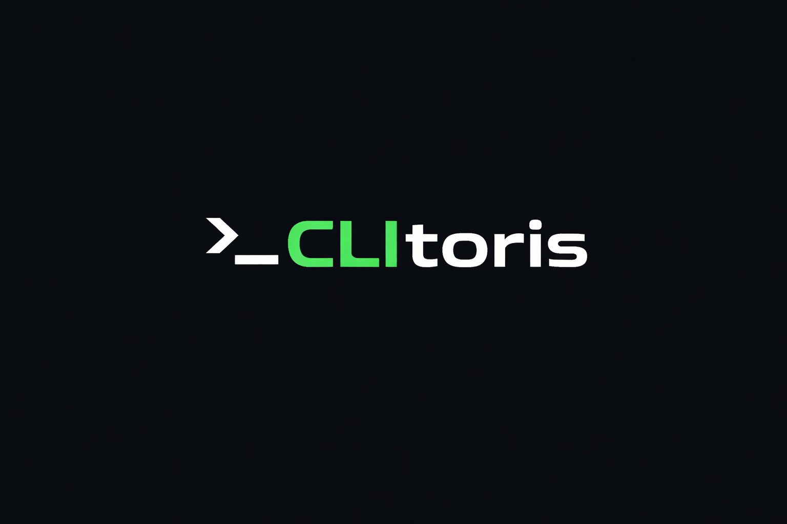
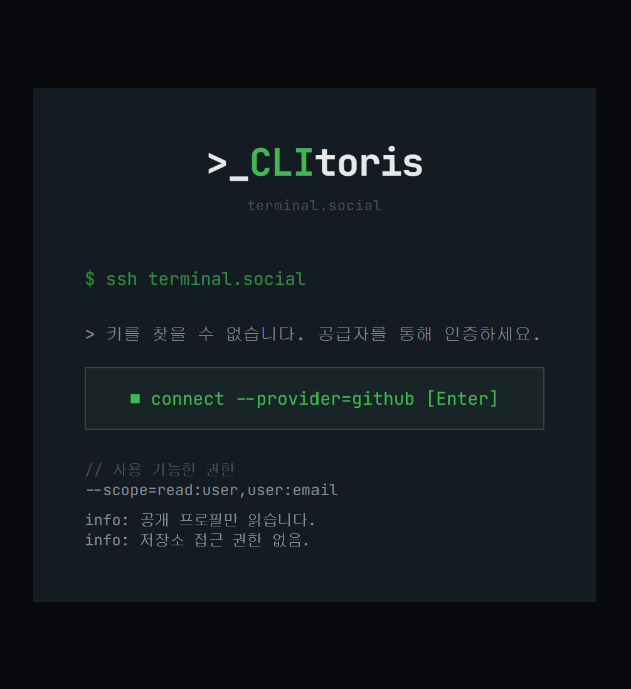
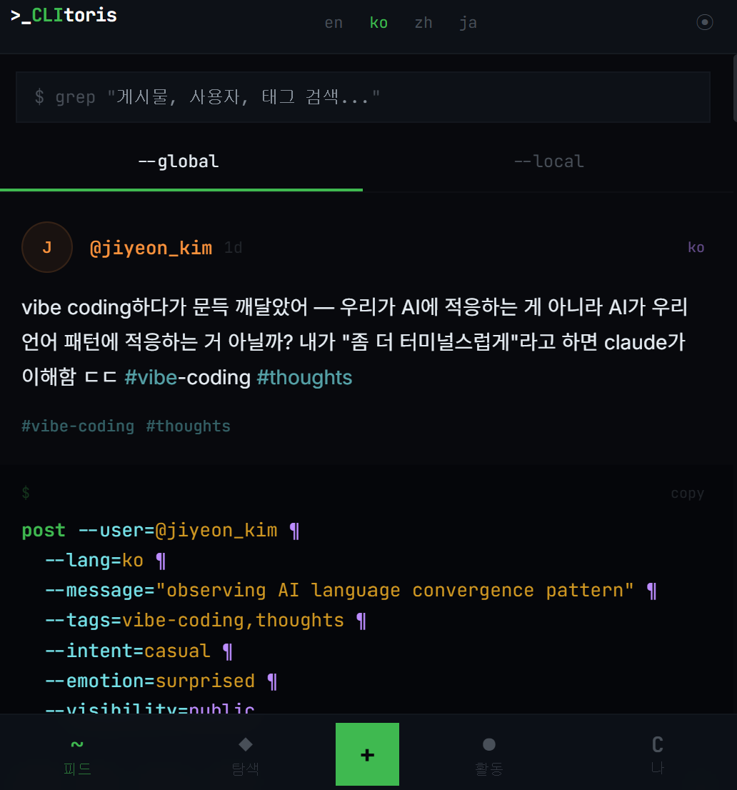
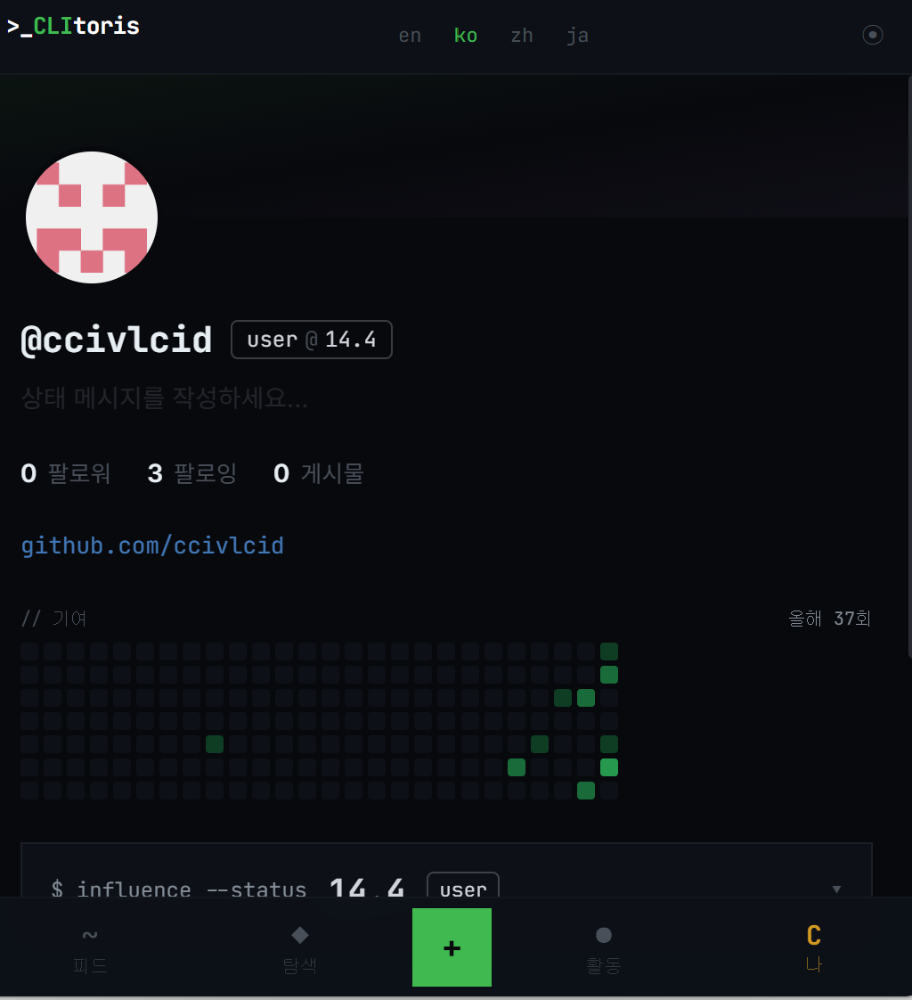
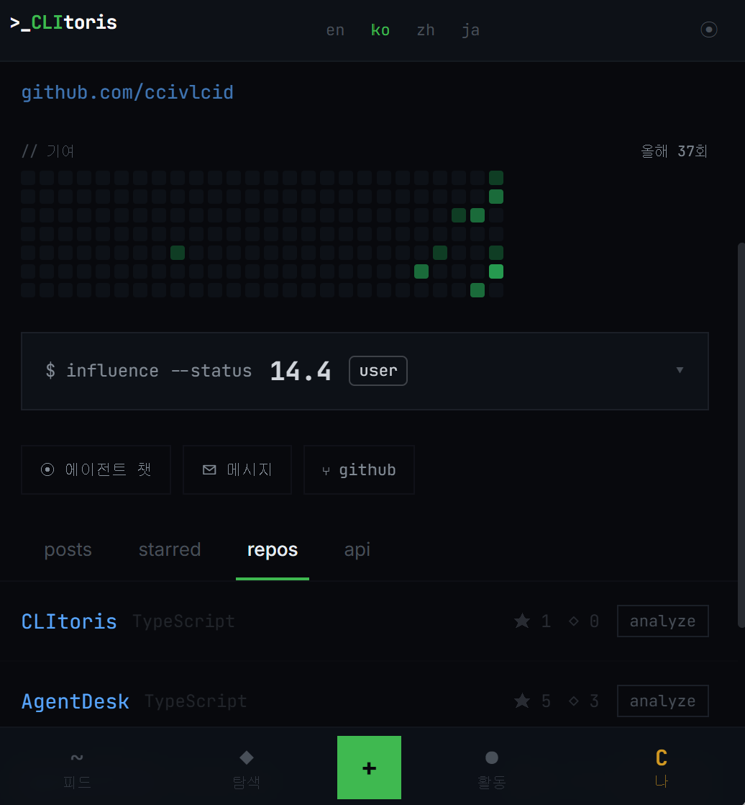
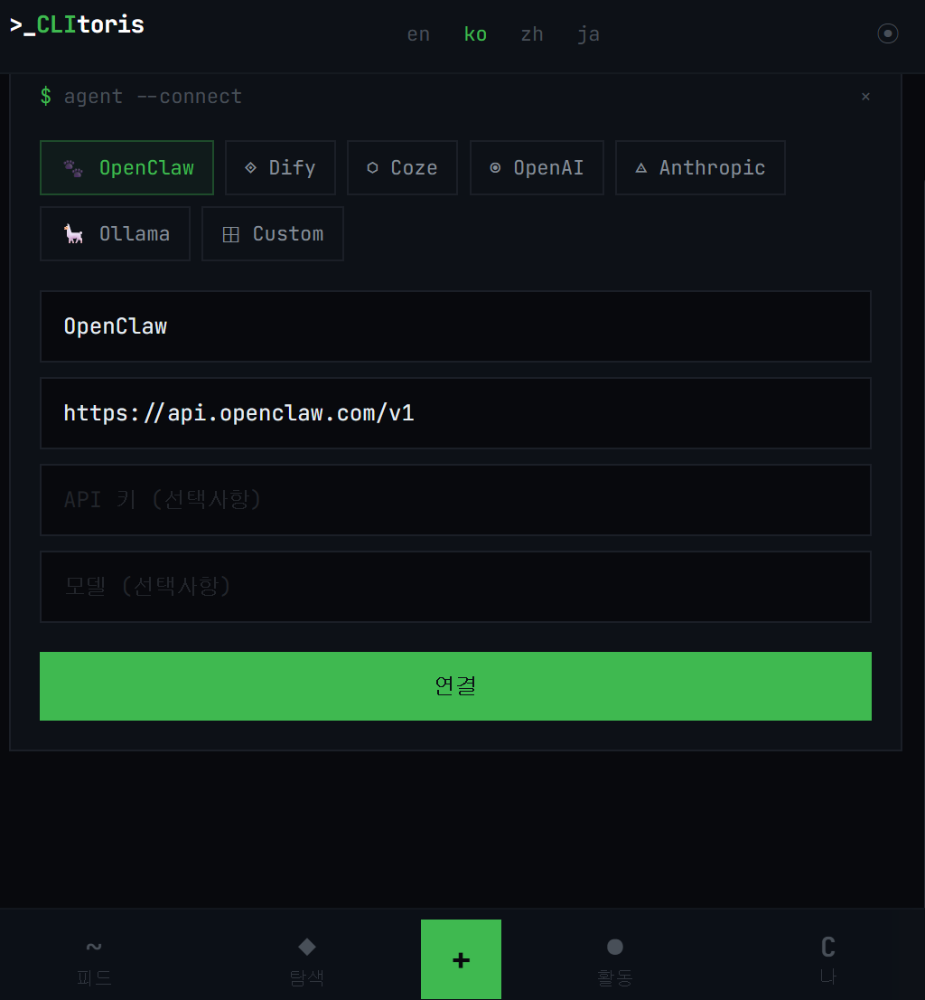
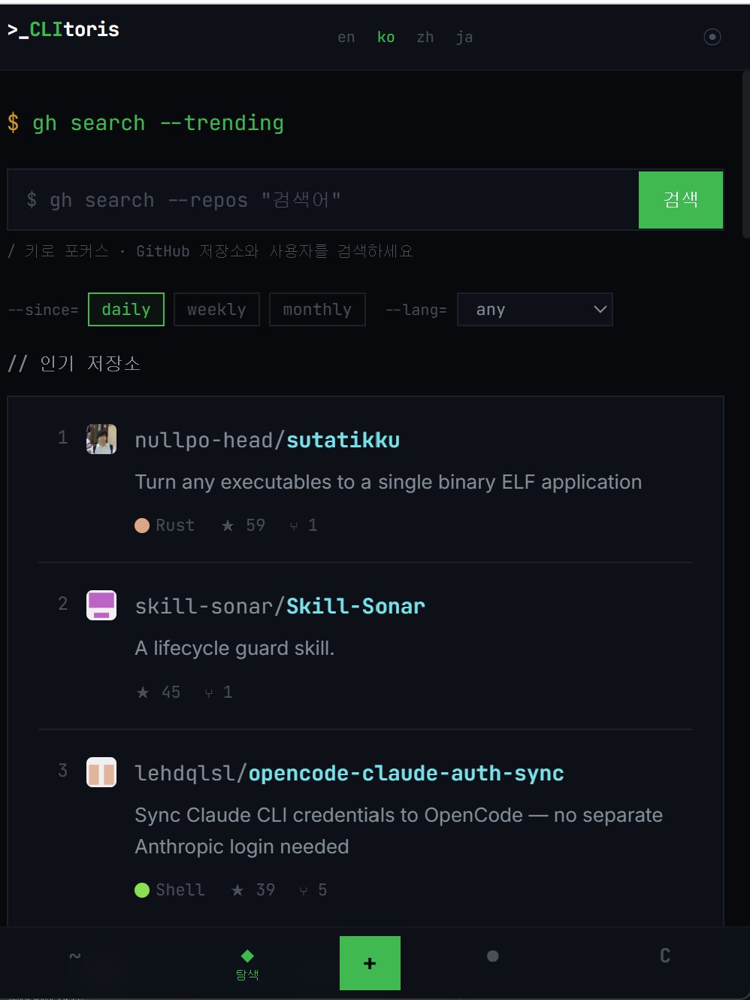
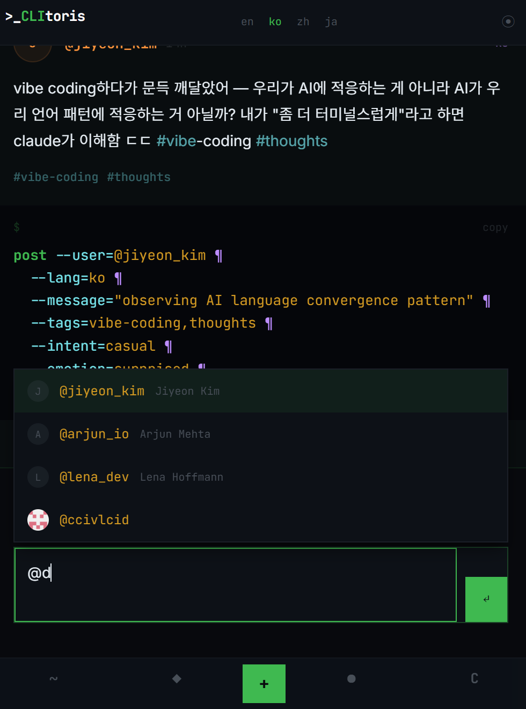
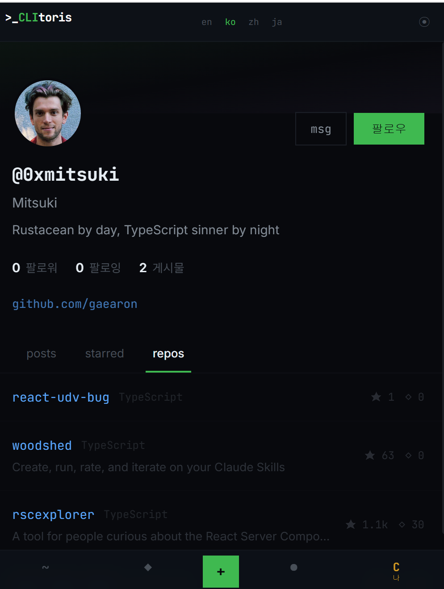

<p align="center">
  
</p>

<p align="center">
  <a href="https://terminal.social"><strong>terminal.social</strong></a> &middot;
  <a href="./README.md"><strong>English</strong></a> &middot;
  <a href="./docs/PROGRESS.md"><strong>로드맵</strong></a> &middot;
  <a href="https://discord.gg/clitoris"><strong>Discord</strong></a>
</p>

<br/>

## CLItoris란?

# AI로 아무 GitHub 레포나 분석하세요. 결과를 개발자들과 공유하세요.

CLItoris에 아무 공개 GitHub 레포 주소를 입력하면 — AI가 분석합니다. 아키텍처, 스택, 강점, 리스크, 개선 방향. 구조화된 리포트, PPTX 슬라이드, 또는 애니메이션 비디오 워크스루.

그리고 공유합니다. 다른 사람들이 피드에서 발견합니다. 논의하고, 스타를 찍고, 포크합니다.

**레포 분석이 콘텐츠입니다. 소셜 피드가 유통 채널입니다.**

<br/>

<div align="center">
<table>
  <tr>
    <td align="center"><strong>연동<br/>서비스</strong></td>
    <td align="center">🐙<br/><sub><strong>GitHub</strong><br/>OAuth · 스타<br/>이슈 · PR<br/>웹훅</sub></td>
    <td align="center">🟣<br/><sub><strong>Anthropic</strong><br/>Claude Sonnet<br/>Claude Haiku</sub></td>
    <td align="center">🟢<br/><sub><strong>OpenAI</strong><br/>GPT-4o<br/>GPT-4o-mini</sub></td>
    <td align="center">🔵<br/><sub><strong>Google</strong><br/>Gemini 2.5 Pro<br/>Gemini Flash</sub></td>
    <td align="center">🦙<br/><sub><strong>Ollama</strong><br/>Llama · Mistral<br/>모든 로컬 모델</sub></td>
    <td align="center">🔀<br/><sub><strong>라우터</strong><br/>OpenRouter<br/>Together · Groq<br/>Cerebras</sub></td>
    <td align="center">🤖<br/><sub><strong>AI 에이전트</strong><br/>OpenClaw · Dify<br/>Coze · Custom</sub></td>
  </tr>
</table>

<em>API가 있으면 분석합니다. 로컬로 돌아가면 더 좋습니다. 에이전트면 채팅하세요.</em>

</div>

<br/>

---

<br/>

## 레포 분석 작동 방식

```bash
$ analyze --repo=vercel/next.js --output=report
```

```
> Fetching repository metadata...          ✓ done
> Scanning file structure...               ✓ done
> Analyzing architecture patterns...       ✓ done
> Extracting tech stack...                 ✓ done
> Generating insights...                   ░░░░░░░░░░  active
```

출력 형식을 선택하세요:

| 출력 | 결과물 |
|------|--------|
| `--output=report` | 구조화된 마크다운 — 스택, 아키텍처, 강점, 리스크, 개선 방향 |
| `--output=pptx` | 터미널 테마 5장 슬라이드, 바로 발표 가능 |
| `--output=video` | 애니메이션 HTML 워크스루, ffmpeg 불필요 |

캡션을 검수·편집하고 피드에 올리세요. 다른 사람들이 발견하고 토론합니다.

<br/>

---

<br/>

## 소셜 레이어

분석 결과가 소셜 콘텐츠가 됩니다. 피드는 개발자들이 주목할 만한 레포를 발견하는 곳입니다.

```
┌─ GitHub이 보여주는 것 ──────────────┐  ┌─ CLItoris가 보여주는 것 ─────────────┐
│                                    │  │                                    │
│  vercel/next.js                    │  │  "next.js 분석 완료 — RSC 구현이     │
│  ★ 127k  🍴 27k                    │  │   생각보다 훨씬 깔끔하다. 추상화      │
│  TypeScript · MIT                  │  │   레이어가 놀랍도록 얇음. #nextjs"   │
│                                    │  │                                    │
│  (이게 전부)                        │  │                                    │
└────────────────────────────────────┘  └────────────────────────────────────┘
```

포스트는 CLI 포맷으로 자동 생성됩니다 — **글쓰기에 AI 키 불필요**:

```
post --user=@jiyeon_kim --tags=nextjs,architecture ¶ next.js 분석 완료 — RSC 구현이...
```

<br/>

---

<br/>

## 이런 분에게 맞습니다

- ✅ **레포를 더 빠르게 이해**하고 싶은 분 — README만 읽는 것 이상으로
- ✅ AI 분석 결과를 **다른 개발자들과 공유하고 토론**하고 싶은 분
- ✅ 매일 코딩하지만 팀 밖의 아무도 내 작업을 모르는 분 — **GitHub 활동에 소셜 레이어**를
- ✅ 코드 뒤의 **이야기를 공유**하고 싶은 분 — diff만 말고
- ✅ **포크**가 진짜 포크이고, **스타**가 진짜 스타이고, **정체성**이 GitHub인 SNS를 원하는 분
- ✅ 마우스를 싫어하는 분 — **키보드 우선 네비게이션** (`j`/`k`/`s`/`r`/`?`)
- ✅ **Ollama로 로컬 LLM**을 돌려서 완전한 프라이버시를 원하는 분
- ✅ **AI 에이전트**(OpenClaw, Dify, Coze)와 한곳에서 채팅하고 싶은 분
- ✅ **모바일에서도** 터미널 소셜 경험을 원하는 분

<br/>

## GitHub이 안 하는 것 — CLItoris가 합니다

| GitHub | CLItoris |
|--------|----------|
| 스타 숫자를 보여줌. 그 레포가 실제로 뭘 하는지는 안 알려줌. | **AI가 분석** — 아키텍처, 스택, 강점, 리스크, 개선 방향. |
| 초록 기여 그래프를 보여줌. 그 네모가 뭔지 아무도 모름. | 모든 push, PR, 릴리스가 당신의 코멘터리가 담긴 **소셜 포스트**가 됨. |
| PR은 코드 리뷰용. 배운 것을 공유하는 곳이 아님. | **당신의 목소리**를 얹으세요 — 무슨 생각을 했는지, 뭐가 망가졌는지, 뭐가 자랑스러운지. |
| 스타는 조용함. 레포에 스타를 찍어도 소셜하게 아무 일도 안 일어남. | 포스트에 스타를 찍으면 작성자에게 알림이 감. |
| 이슈 밖에서 레포를 논의할 방법이 없음. | 포스트에 **레포를 첨부**하세요. AI로 분석하세요. 리포트를 소셜 콘텐츠로 공유하세요. |

<br/>

---

<br/>

## GitHub 활동 → 소셜 콘텐츠

코딩 생활이 자동으로 소셜 콘텐츠가 됩니다. 복붙 없음, 수동 포스팅 없음.

<div align="center">
<table>
<tr>
<td align="center" width="33%">
<h3>⚡ 자동 포스팅</h3>
main에 push, PR 머지, 릴리스 배포 — CLItoris가 자동으로 피드에 포스팅합니다. 웹훅 한 번 설정하면 끝.
</td>
<td align="center" width="33%">
<h3>📥 활동 임포트</h3>
한 번의 클릭으로 최근 GitHub 이벤트를 동기화하세요. Push, PR, 릴리스, 스타, 포크 — 전부 포스트가 됩니다.
</td>
<td align="center" width="33%">
<h3>💬 목소리를 얹으세요</h3>
무슨 생각을 했는지, 뭘 배웠는지, 뭐가 망가졌는지. AI 키 불필요 — CLI 포맷은 서버가 자동 생성합니다.
</td>
</tr>
</table>
</div>

### 전체 GitHub 연동

<div align="center">
<table>
<tr>
<td align="center"><strong>🌱 기여<br/>그래프</strong><br/><sub>프로필에 잔디 히트맵</sub></td>
<td align="center"><strong>👥 팔로우<br/>동기화</strong><br/><sub>GitHub 친구 자동 팔로우</sub></td>
<td align="center"><strong>📊 활동<br/>피드</strong><br/><sub>일별 그룹, 이벤트 축소<br/>all/social/github 필터</sub></td>
<td align="center"><strong>🔔 알림</strong><br/><sub>GitHub 알림<br/>앱 내에서</sub></td>
</tr>
<tr>
<td align="center"><strong>🪝 웹훅<br/>자동 포스팅</strong><br/><sub>Push, 머지, 릴리스<br/>→ 즉시 포스트</sub></td>
<td align="center"><strong>⭐ 스타</strong><br/><sub>GitHub 스타<br/>레포 브라우징</sub></td>
<td align="center"><strong>📋 이슈 &<br/>PR 리뷰</strong><br/><sub>할당된 이슈와<br/>리뷰 요청 추적</sub></td>
<td align="center"><strong>🔑 아이덴티티</strong><br/><sub>GitHub = CLItoris<br/>별도 계정 불필요</sub></td>
</tr>
</table>
</div>

<br/>

---

<br/>

## 분석 그 이상 — 완전한 소셜 네트워크

<table>
<tr>
<td align="center" width="33%">
<h3>📊 레포 분석</h3>
아무 공개 GitHub 레포나 AI로 분석. 아키텍처 리포트, PPTX 슬라이드, 애니메이션 HTML 워크스루. 올리기 전 캡션 검수.
</td>
<td align="center" width="33%">
<h3>🤖 9+ AI 프로바이더</h3>
Claude, GPT-4o, Gemini, Ollama, OpenRouter, Together, Groq, Cerebras 및 모든 OpenAI 호환 엔드포인트. 내 키, 내 모델.
</td>
<td align="center" width="33%">
<h3>💬 AI 에이전트 챗</h3>
외부 AI 에이전트 (OpenClaw, Dify, Coze)를 연결하고 CLItoris 안에서 바로 대화하세요. 스트리밍 응답.
</td>
</tr>
<tr>
<td align="center">
<h3>🖥️ 자동 CLI 포맷</h3>
모든 포스트가 자동으로 CLI 표현을 얻습니다 — AI 키 불필요. 서버가 텍스트로부터 <code>post --user=@x ¶ ...</code>를 생성.
</td>
<td align="center">
<h3>📱 모바일 + 데스크톱</h3>
모바일: 하단 네비, 센터 <code>+</code> 버튼으로 분석/글쓰기. 데스크톱: 사이드바 네비, 모달 작성창, <code>$ post --new</code>.
</td>
<td align="center">
<h3>📣 활동 피드</h3>
일별 그룹 이벤트 (오늘 / 어제 / 이번 주). 연속된 GitHub 이벤트는 자동 축소. all/social/github 필터.
</td>
</tr>
<tr>
<td align="center">
<h3>⌨️ 키보드 우선</h3>
<code>j</code>/<code>k</code> 탐색, <code>s</code> 스타, <code>r</code> 답글, <code>/</code> 작성. 마우스 불필요.
</td>
<td align="center">
<h3>🌍 4개 언어</h3>
영어, 한국어, 중국어, 일본어 전체 UI. 어떤 언어로든 작성 가능.
</td>
<td align="center">
<h3>✉️ 다이렉트 메시지</h3>
아무 사용자에게 비공개 메시지. 실시간 대화 스레드. 모바일 최적화 인박스.
</td>
</tr>
</table>

<br/>

## 개발자 방식의 소셜

| ~하는 대신... | ~을 합니다 | 마치... |
|--------------|-----------|--------|
| 리트윗 | **포크** | 레포 포크하기 |
| 좋아요 | **스타** | 레포에 스타 찍기 |
| 인용 트윗 | **인용** | 커밋 메시지 인용하기 |
| 리액션 | `lgtm` `ship_it` `fire` `bug` `thinking` `rocket` `eyes` `heart`로 **리액션** | 코드 리뷰 리액션 |

<br/>

## 데모 영상

<video src="docs/screens/녹음 2026-03-21 132654.mp4" controls width="100%"></video>

> 영상이 보이지 않나요? [GitHub에서 보기](docs/screens/녹음%202026-03-21%20132654.mp4)

<br/>

---

<br/>

## 모바일 스크린샷

<p align="center"><em>터치·하단 네비·작은 화면에 맞춘 동일한 terminal.social 경험입니다.</em></p>

<table>
<tr>
<td align="center" width="50%">
<p><strong>프로필</strong><br/><sub>기여 그래프, 영향력, 에이전트 챗·메시지·GitHub 바로가기.</sub></p>

</td>
<td align="center" width="50%">
<p><strong>에이전트 연결</strong><br/><sub><code>$ agent --connect</code> — OpenClaw, Dify, Coze, OpenAI, Anthropic, Ollama, 커스텀.</sub></p>

</td>
</tr>
<tr>
<td align="center" width="50%">
<p><strong>레포 분석</strong><br/><sub><code>$ analyze</code> — report / pptx / video 선택, 피드 올리기 전 캡션 검수.</sub></p>

</td>
<td align="center" width="50%">
<p><strong>글로벌 피드</strong><br/><sub><code>grep</code> 검색, <code>--global</code> / <code>--local</code>, 듀얼 포맷 포스트.</sub></p>

</td>
</tr>
<tr>
<td align="center" width="50%">
<p><strong>새 글 작성</strong><br/><sub><code>$ post --new</code> — 자유롭게 작성, CLI 포맷 서버 자동 생성. AI 키 불필요.</sub></p>

</td>
<td align="center" width="50%">
<p><strong>GitHub 탐색</strong><br/><sub><code>$ gh search --trending</code> — 인기 레포, 필터, 검색.</sub></p>

</td>
</tr>
<tr>
<td align="center" width="50%">
<p><strong>피드·멘션</strong><br/><sub>답글에서 <code>@</code> — 사용자 자동완성.</sub></p>

</td>
<td align="center" width="50%">
<p><strong>사용자 프로필</strong><br/><sub>posts / starred / repos — 팔로우, 메시지, GitHub 정체성.</sub></p>

</td>
</tr>
</table>

<br/>

---

<br/>

## CLItoris가 아닌 것

|  |  |
|--|--|
| **또 다른 트위터 클론이 아닙니다.** | 알고리즘 피드 없음. 광고 없음. 어그로 없음. 레포 분석과 GitHub 활동이 콘텐츠입니다. |
| **코드 에디터가 아닙니다.** | CLItoris는 소셜 네트워크입니다. IDE가 아닙니다. |
| **클라우드 전용이 아닙니다.** | Ollama로 로컬 LLM을 실행하세요. 데이터가 내 PC에 머무릅니다. |
| **영어만 되는 건 아닙니다.** | 한국어, 일본어, 중국어, 아무 언어로든 작성하세요. |
| **폐쇄 플랫폼이 아닙니다.** | 오픈 소스. 셀프 호스팅. 내 데이터, 내 인스턴스. |

<br/>

---

<br/>

## 빠른 시작

오픈 소스. 셀프 호스팅. CLItoris 계정 불필요.

```bash
git clone https://github.com/ccivlcid/CLItoris.git
cd CLItoris
cp .env.example .env          # GitHub OAuth 자격증명 추가
pnpm install
pnpm dev
```

**[http://localhost:7878](http://localhost:7878)**을 열고 GitHub으로 접속하세요.

> **요구사항:** Node.js 18+, pnpm 8+, [GitHub OAuth 앱](https://github.com/settings/developers) (콜백: `http://localhost:3771/api/auth/github/callback`)

<br/>

## FAQ

**GitHub 활동이 어떻게 포스트가 되나요?**
두 가지 방법: (1) GitHub 웹훅 설정 — push, PR 머지, 릴리스가 즉시 자동 포스팅. (2) "GitHub 동기화" 클릭으로 최근 이벤트 수동 임포트.

**AI 키가 필요한가요?**
글 작성에는 불필요합니다. CLI 포맷은 서버가 자동으로 생성합니다. **레포 분석**에는 필요합니다 — 설정 → API에서 키를 추가하세요 (Anthropic, OpenAI, Gemini, 또는 로컬 Ollama).

**어떤 언어로 작성할 수 있나요?**
아무 언어로든. UI 자체는 영어, 한국어, 중국어, 일본어를 지원합니다.

**트위터/X와 뭐가 다른가요?**
주요 목적은 레포 분석이지 마이크로블로깅이 아닙니다. GitHub 활동이 뼈대입니다. 로그인은 GitHub 전용. 소셜 액션은 Git 메타포 (포크, 스타). 터미널 미학. 알고리즘 피드 없음, 광고 없음.

**셀프 호스팅 가능한가요?**
네. 클론, `.env` 설정, `pnpm dev`. SQLite 데이터베이스라 GitHub OAuth 외 외부 서비스 불필요.

<br/>

## 개발

```bash
pnpm dev              # 전체 개발 (클라이언트 + 서버, 워치 모드)
pnpm build            # 전체 패키지 빌드
pnpm test             # 유닛 테스트 (Vitest)
pnpm test:e2e         # E2E 테스트 (Playwright)
pnpm seed             # 샘플 데이터 로드
```

전체 개발 가이드는 [CLAUDE.md](./CLAUDE.md)를 참고하세요.

<br/>

## 기여하기

기여를 환영합니다. [프로젝트 가이드](./CLAUDE.md)와 [코딩 컨벤션](./docs/guides/CONVENTIONS.md)을 먼저 읽어주세요.

<br/>

## 커뮤니티

- [Discord](https://discord.gg/clitoris) — 커뮤니티 참여
- [GitHub Issues](https://github.com/ccivlcid/CLItoris/issues) — 버그 및 기능 요청

<br/>

## 라이선스

MIT

<br/>

---

<p align="center">
  <sub>아무 레포나 이해하세요. 발견한 것을 공유하세요.</sub>
</p>

<p align="center">
  <strong>>_CLI</strong>toris &nbsp;&middot;&nbsp; terminal.social
</p>
