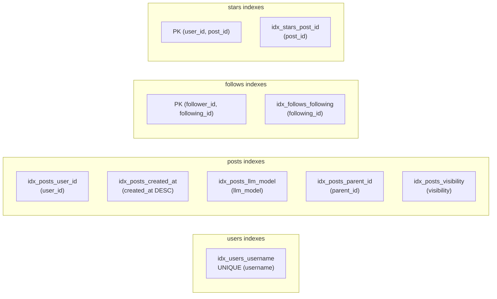

# Schema ERD — Database Entity Relationship Diagram

> **Source of truth** for database entity relationships, cardinality, and design decisions.

## Mermaid Diagram

```mermaid
erDiagram
    users {
        TEXT id PK "UUID v7"
        TEXT username UK "unique handle"
        TEXT password_hash "bcrypt hash (never exposed)"
        TEXT domain "custom domain (nullable)"
        TEXT display_name "display name (nullable)"
        TEXT bio "profile bio (nullable)"
        TEXT avatar_url "avatar URL (nullable)"
        TEXT created_at "ISO 8601 timestamp"
    }

    posts {
        TEXT id PK "UUID v7"
        TEXT user_id FK "references users.id"
        TEXT message_raw "natural language content"
        TEXT message_cli "CLI command representation"
        TEXT lang "ISO 639-1 code (default: en)"
        TEXT tags "JSON array of strings"
        TEXT mentions "JSON array of usernames"
        TEXT visibility "public | private | unlisted"
        TEXT llm_model "claude-sonnet | gpt-4o | llama-3 | custom"
        TEXT parent_id FK "reply parent (nullable)"
        TEXT forked_from_id FK "fork source (nullable)"
        TEXT created_at "ISO 8601 timestamp"
    }

    follows {
        TEXT follower_id PK_FK "references users.id"
        TEXT following_id PK_FK "references users.id"
        TEXT created_at "ISO 8601 timestamp"
    }

    stars {
        TEXT user_id PK_FK "references users.id"
        TEXT post_id PK_FK "references posts.id"
        TEXT created_at "ISO 8601 timestamp"
    }

    users ||--o{ posts : "creates"
    users ||--o{ follows : "follower"
    users ||--o{ follows : "following"
    users ||--o{ stars : "stars"
    posts ||--o{ stars : "starred by"
    posts ||--o{ posts : "reply (parent_id)"
    posts ||--o{ posts : "fork (forked_from_id)"
```

## Relationships

| Relationship | Type | Description |
|-------------|------|-------------|
| `users` → `posts` | One-to-Many | A user creates many posts |
| `posts` → `posts` (parent_id) | Self-referencing | A post can have many replies |
| `posts` → `posts` (forked_from_id) | Self-referencing | A post can be forked many times |
| `users` ↔ `users` (via follows) | Many-to-Many | Users follow each other |
| `users` ↔ `posts` (via stars) | Many-to-Many | Users star posts |

## Cardinality

```
users  1 ──── * posts          (one user has many posts)
users  * ──── * users          (many-to-many via follows)
users  * ──── * posts          (many-to-many via stars)
posts  1 ──── * posts          (one post has many replies)
posts  1 ──── * posts          (one post has many forks)
```

## Indexes



## Key Design Decisions

| Decision | Rationale |
|----------|-----------|
| TEXT primary keys (UUID v7) | Sortable by creation time; no auto-increment conflicts in distributed scenarios |
| JSON-as-TEXT columns (tags, mentions) | SQLite has no native array type; parsed in application code |
| ISO 8601 TEXT timestamps | SQLite has no native datetime; string comparison works for sorting |
| Composite PKs for follows/stars | Prevents duplicates at DB level; no separate ID needed |
| Self-referencing FKs on posts | Enables reply chains and fork trees without extra tables |
| No soft deletes | Hard delete only; simplicity over recoverability for MVP |
| No denormalized counts | star_count, reply_count computed via subqueries; denormalize later if needed |

## Data Flow Examples

### Creating a Post
```
1. INSERT INTO posts (id, user_id, message_raw, message_cli, ...) VALUES (?, ?, ?, ?, ...)
2. Return inserted row with user JOIN
```

### Starring a Post (Toggle)
```
1. SELECT 1 FROM stars WHERE user_id = ? AND post_id = ?
2a. If exists  → DELETE FROM stars WHERE user_id = ? AND post_id = ?
2b. If not     → INSERT INTO stars (user_id, post_id) VALUES (?, ?)
3. SELECT COUNT(*) FROM stars WHERE post_id = ?
4. Return { starred: boolean, starCount: number }
```

### Forking a Post
```
1. SELECT * FROM posts WHERE id = ?  (original)
2. INSERT INTO posts (id, user_id, message_raw, message_cli, ..., forked_from_id)
   VALUES (new_id, current_user, original.message_raw, original.message_cli, ..., original.id)
3. Return new post with forkedFromId set
```

### Loading Global Feed
```
1. SELECT p.*, u.username, u.domain, u.display_name, u.avatar_url,
          (SELECT COUNT(*) FROM stars WHERE post_id = p.id) AS star_count,
          (SELECT COUNT(*) FROM posts WHERE parent_id = p.id) AS reply_count,
          (SELECT COUNT(*) FROM posts WHERE forked_from_id = p.id) AS fork_count
   FROM posts p
   JOIN users u ON p.user_id = u.id
   WHERE p.visibility = 'public'
     AND p.parent_id IS NULL
     AND p.created_at < ?   -- cursor
   ORDER BY p.created_at DESC
   LIMIT 20
```

---

## See Also

- [DATABASE.md](../specs/DATABASE.md) — Full schema, indexes, migrations, common queries
- [ARCHITECTURE.md](./ARCHITECTURE.md) — System data flows
- [API.md](../specs/API.md) — How endpoints map to these queries
