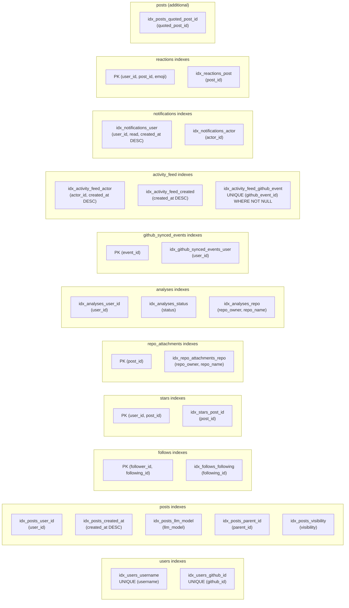

# Schema ERD — Database Entity Relationship Diagram

> Relationships diagram only. For full schema with column types, defaults, and indexes, see [`DATABASE.md`](../specs/DATABASE.md).

## Mermaid Diagram

```mermaid
erDiagram
    users {
        TEXT id PK "UUID v7"
        TEXT username UK "unique handle"
        TEXT domain "custom domain (nullable)"
        TEXT display_name "display name (nullable)"
        TEXT bio "profile bio (nullable)"
        TEXT avatar_url "avatar URL (nullable)"
        TEXT github_id UK "GitHub OAuth ID"
        TEXT github_username "GitHub username"
        TEXT github_avatar_url "GitHub avatar (nullable)"
        TEXT github_profile_url "GitHub profile URL (nullable)"
        INTEGER github_repos_count "public repo count"
        TEXT github_connected_at "OAuth first connect timestamp"
        TEXT github_access_token "OAuth access token (nullable)"
        TEXT github_token_scope "granted OAuth scopes (nullable)"
        TEXT created_at "ISO 8601 timestamp"
    }

    posts {
        TEXT id PK "UUID v7"
        TEXT user_id FK "references users.id"
        TEXT message_raw "natural language content"
        TEXT message_cli "CLI command representation"
        TEXT lang "ISO 639-1 code (default: en)"
        TEXT tags "JSON array of strings"
        TEXT mentions "JSON array of usernames"
        TEXT visibility "public | private | unlisted"
        TEXT llm_model "free-form model identifier"
        TEXT parent_id FK "reply parent (nullable)"
        TEXT forked_from_id FK "fork source (nullable)"
        TEXT intent "casual | formal | question | announcement | reaction"
        TEXT emotion "neutral | happy | surprised | frustrated | excited | sad | angry"
        TEXT quoted_post_id FK "quoted post (nullable)"
        TEXT created_at "ISO 8601 timestamp"
    }

    follows {
        TEXT follower_id PK_FK "references users.id"
        TEXT following_id PK_FK "references users.id"
        TEXT created_at "ISO 8601 timestamp"
    }

    stars {
        TEXT user_id PK_FK "references users.id"
        TEXT post_id PK_FK "references posts.id"
        TEXT created_at "ISO 8601 timestamp"
    }

    repo_attachments {
        TEXT post_id PK_FK "references posts.id"
        TEXT repo_owner "GitHub repo owner"
        TEXT repo_name "GitHub repo name"
        INTEGER repo_stars "cached star count"
        INTEGER repo_forks "cached fork count"
        TEXT repo_language "primary language (nullable)"
        TEXT cached_at "last cache timestamp"
    }

    analyses {
        TEXT id PK "UUID v7"
        TEXT user_id FK "references users.id"
        TEXT repo_owner "GitHub repo owner"
        TEXT repo_name "GitHub repo name"
        TEXT output_type "report | pptx | video"
        TEXT llm_model "LLM model used"
        TEXT lang "output language"
        TEXT options_json "JSON options"
        TEXT result_url "download URL (nullable)"
        TEXT result_summary "brief summary (nullable)"
        TEXT status "pending | processing | completed | failed"
        INTEGER duration_ms "time taken (nullable)"
        TEXT created_at "ISO 8601 timestamp"
    }

    github_synced_events {
        TEXT event_id PK "GitHub event ID"
        TEXT user_id FK "references users.id"
        TEXT event_type "PushEvent | PullRequestEvent | etc."
        TEXT synced_at "ISO 8601 timestamp"
    }

    user_llm_keys {
        TEXT id PK "UUID v7"
        TEXT user_id FK "references users.id"
        TEXT provider "anthropic | openai | gemini | api | etc."
        TEXT api_key "encrypted API key"
        TEXT base_url "custom base URL (nullable)"
        TEXT label "user label (nullable)"
        TEXT created_at "ISO 8601 timestamp"
    }

    translations {
        TEXT id PK "UUID v7"
        TEXT post_id FK "references posts.id"
        TEXT lang "target language code"
        TEXT text "translated content"
        TEXT created_at "ISO 8601 timestamp"
    }

    webhook_deliveries {
        TEXT delivery_id PK "GitHub delivery UUID"
        TEXT received_at "ISO 8601 timestamp"
    }

    activity_feed {
        TEXT id PK "UUID v7"
        TEXT actor_id FK "references users.id"
        TEXT event_type "follow | star_post | fork_post | reply | github_*"
        TEXT target_user_id FK "target user (nullable)"
        TEXT target_post_id FK "target post (nullable)"
        TEXT metadata "JSON metadata"
        TEXT github_event_id "dedup key (nullable, unique)"
        TEXT created_at "ISO 8601 timestamp"
    }

    notifications {
        TEXT id PK "UUID v7"
        TEXT user_id FK "references users.id"
        TEXT type "reply | mention | quote | star | fork | follow | reaction"
        TEXT actor_id FK "references users.id"
        TEXT post_id FK "related post (nullable)"
        TEXT message "preview text (nullable)"
        INTEGER read "0=unread, 1=read"
        TEXT created_at "ISO 8601 timestamp"
    }

    reactions {
        TEXT user_id PK_FK "references users.id"
        TEXT post_id PK_FK "references posts.id"
        TEXT emoji PK "lgtm | ship_it | fire | bug | thinking | rocket | eyes | heart"
        TEXT created_at "ISO 8601 timestamp"
    }

    users ||--o{ posts : "creates"
    users ||--o{ follows : "follower"
    users ||--o{ follows : "following"
    users ||--o{ stars : "stars"
    users ||--o{ analyses : "requests"
    users ||--o{ github_synced_events : "synced events"
    posts ||--o{ stars : "starred by"
    posts ||--o{ posts : "reply (parent_id)"
    posts ||--o{ posts : "fork (forked_from_id)"
    posts ||--o{ posts : "quote (quoted_post_id)"
    posts ||--o| repo_attachments : "attaches"
    posts ||--o{ translations : "translated to"
    posts ||--o{ reactions : "reacted on"
    users ||--o{ user_llm_keys : "configures"
    users ||--o{ activity_feed : "performs"
    users ||--o{ notifications : "receives"
    users ||--o{ notifications : "triggers (actor)"
    users ||--o{ reactions : "reacts"
```

## Relationships

| Relationship | Type | Cardinality | Description |
|-------------|------|-------------|-------------|
| `users` → `posts` | One-to-Many | 1:N | A user creates many posts |
| `posts` → `posts` (parent_id) | Self-referencing | 1:N | A post can have many replies |
| `posts` → `posts` (forked_from_id) | Self-referencing | 1:N | A post can be forked many times |
| `users` ↔ `users` (via follows) | Many-to-Many | M:N | Users follow each other |
| `users` ↔ `posts` (via stars) | Many-to-Many | M:N | Users star posts |
| `posts` → `repo_attachments` | One-to-One | 1:0..1 | A post can attach one repo |
| `users` → `analyses` | One-to-Many | 1:N | A user requests many analyses |
| `users` → `github_synced_events` | One-to-Many | 1:N | A user has many synced GitHub events (dedup log) |
| `users` → `user_llm_keys` | One-to-Many | 1:N | A user configures many LLM API keys |
| `posts` → `translations` | One-to-Many | 1:N | A post can have many translations (one per language) |
| `posts` → `posts` (quoted_post_id) | Self-referencing | 1:N | A post can be quoted many times |
| `users` → `activity_feed` | One-to-Many | 1:N | A user performs many activities |
| `users` → `notifications` | One-to-Many | 1:N | A user receives/triggers many notifications |
| `users` ↔ `posts` (via reactions) | Many-to-Many | M:N | Users react to posts with emoji |

## Cardinality

```
users  1 ──── * posts          (one user has many posts)
users  * ──── * users          (many-to-many via follows)
users  * ──── * posts          (many-to-many via stars)
posts  1 ──── * posts          (one post has many replies)
posts  1 ──── * posts          (one post has many forks)
posts  1 ──── 0..1 repo_attachments  (one post attaches at most one repo)
users  1 ──── * analyses       (one user requests many analyses)
users  1 ──── * github_synced_events  (one user has many deduped event records)
users  1 ──── * user_llm_keys        (one user configures many API keys)
posts  1 ──── * translations          (one post has many translations)
posts  1 ──── * posts                 (one post is quoted many times)
users  1 ──── * activity_feed         (one user performs many activities)
users  1 ──── * notifications         (one user receives many notifications)
users  * ──── * posts                 (many-to-many via reactions)
```

## Indexes



## Key Design Decisions

| Decision | Rationale |
|----------|-----------|
| TEXT primary keys (UUID v7) | Sortable by creation time; no auto-increment conflicts in distributed scenarios |
| JSON-as-TEXT columns (tags, mentions) | SQLite has no native array type; parsed in application code |
| ISO 8601 TEXT timestamps | SQLite has no native datetime; string comparison works for sorting |
| Composite PKs for follows/stars | Prevents duplicates at DB level; no separate ID needed |
| Self-referencing FKs on posts | Enables reply chains and fork trees without extra tables |
| No soft deletes | Hard delete only; simplicity over recoverability for MVP |
| No denormalized counts | star_count, reply_count computed via subqueries; denormalize later if needed |

## Data Flow Examples

### Creating a Post
```
1. INSERT INTO posts (id, user_id, message_raw, message_cli, ...) VALUES (?, ?, ?, ?, ...)
2. Return inserted row with user JOIN
```

### Starring a Post (Toggle)
```
1. SELECT 1 FROM stars WHERE user_id = ? AND post_id = ?
2a. If exists  → DELETE FROM stars WHERE user_id = ? AND post_id = ?
2b. If not     → INSERT INTO stars (user_id, post_id) VALUES (?, ?)
3. SELECT COUNT(*) FROM stars WHERE post_id = ?
4. Return { starred: boolean, starCount: number }
```

### Forking a Post
```
1. SELECT * FROM posts WHERE id = ?  (original)
2. INSERT INTO posts (id, user_id, message_raw, message_cli, ..., forked_from_id)
   VALUES (new_id, current_user, original.message_raw, original.message_cli, ..., original.id)
3. Return new post with forkedFromId set
```

### Loading Global Feed
```
1. SELECT p.*, u.username, u.domain, u.display_name, u.avatar_url,
          (SELECT COUNT(*) FROM stars WHERE post_id = p.id) AS star_count,
          (SELECT COUNT(*) FROM posts WHERE parent_id = p.id) AS reply_count,
          (SELECT COUNT(*) FROM posts WHERE forked_from_id = p.id) AS fork_count
   FROM posts p
   JOIN users u ON p.user_id = u.id
   WHERE p.visibility = 'public'
     AND p.parent_id IS NULL
     AND p.created_at < ?   -- cursor
   ORDER BY p.created_at DESC
   LIMIT 20
```

---

## See Also

- [DATABASE.md](../specs/DATABASE.md) — Full schema, indexes, migrations, common queries
- [ARCHITECTURE.md](./ARCHITECTURE.md) — System data flows
- [API.md](../specs/API.md) — How endpoints map to these queries
